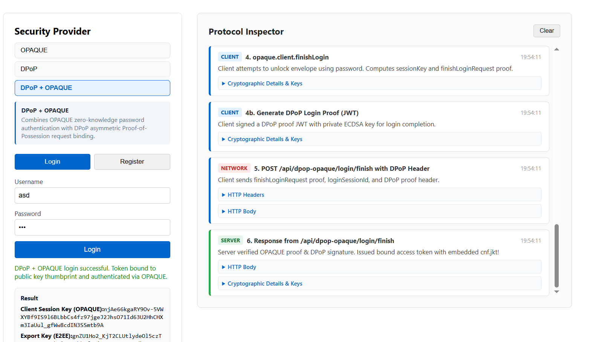
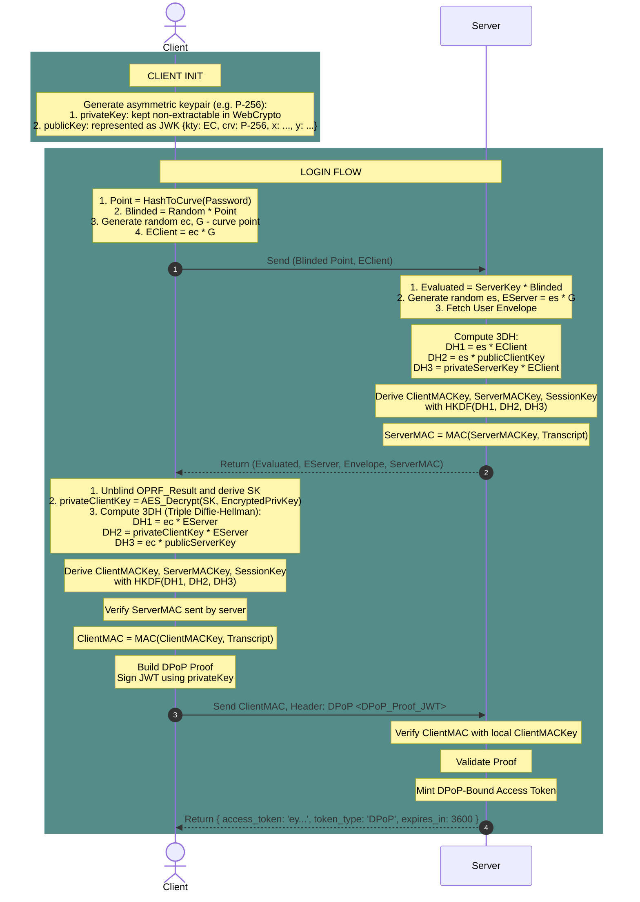
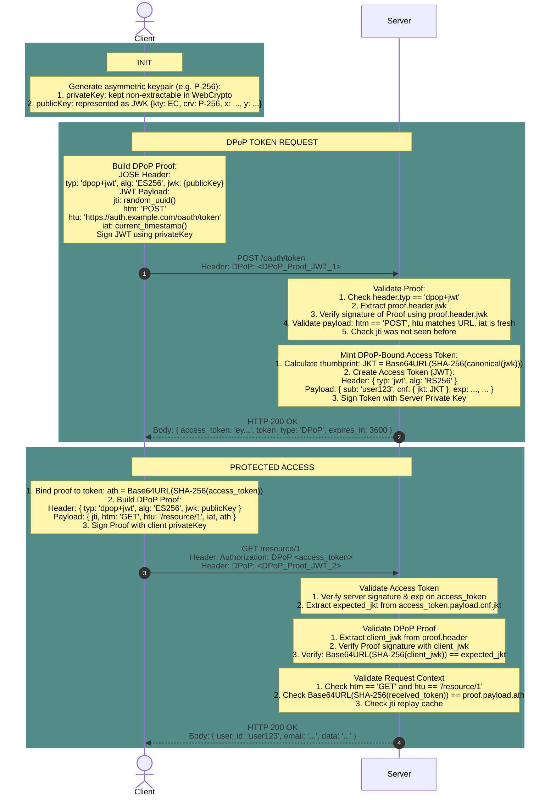
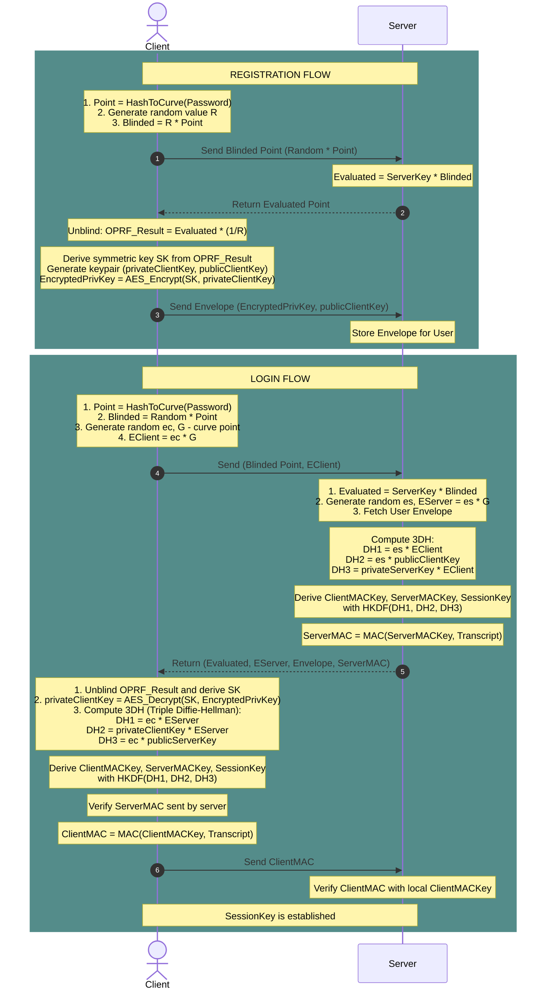

# OPAQUE + DPoP Proof of Concept (PoC)

An integrated cryptographic authentication and authorization Proof of Concept combining the **OPAQUE protocol (RFC 9892)** with **Demonstrating Proof-of-Possession (DPoP, RFC 9449)** for modern applications.

Developed as part of a Bachelor's Thesis in Computer Science at TU Wien.

---
## Start

To start the application, run
```
cd dpop-opaque-protocol
npm install
npm start
```
---
## Overview

Traditional Web applications often suffer from fundamental security issues:
- Passwords sent over the network as a clear text (even over TLS) or stored as hashes are susceptible to server-side database compromise, offline dictionary attacks, and credential stuffing.
- Standard OAuth 2.0 Bearer tokens are bearer credentials: if intercepted via XSS, network eavesdropping, or server logging, an attacker can reuse them directly.

This project demonstrates a zero-knowledge, password-authenticated architecture combined with cryptographically bound access tokens:
- **Asymmetric PAKE (OPAQUE):** The server never learns the user's password, and no password hashes are stored in the database. Client and server mutually authenticate each other using an Oblivious Pseudorandom Function (OPRF) and a 3-way Diffie-Hellman handshake (3DH).
- **Constrained Tokens (DPoP):** Upon successful OPAQUE login, the Server binds the minted JWT Access Token to a non-extractable asymmetric key generated via WebCrypto on the client. 
- **Protected Resource Access:** Every API request requires a short-lived, signed DPoP-Proof cross-bound to the access token and HTTP method/URI, preventing token hijacking and replay attacks.

---

### Integrated OPAQUE Login & DPoP Binding Flow
During the final phase of OPAQUE authentication, the client completes the mutual handshake by computing the `ClientMAC` over the session transcript. Simultaneously, the client signs a DPoP Proof containing its public JWK. The server validates both the credentials and the proof, computes the canonical JWK Thumbprint (`cnf.jkt`), and issues a bound Access Token.


---
### DPoP
#### **Init**
1. Client generates public-private keypair

#### **Binding**
1. Client creates JWT DPoP-Proof with JWK, signs it with private key and sends it to the Server
2. Server reads public key and checks correctness of the DPoP-Proof Signature
3. Server calculates JKT from obtained JWK (SHA256 the JWK and encode as Base64 URL) 
4. Server mints an access token with JKT embedded inside of it and returns it to the client.

#### **Accessing resources**
1. Client generates JWT DPoP-Proof with HTTP method, url and hash of the access token
2. Client requests specified resource with access token and DPoP-Proof in headers
3. Server takes JWK from DPoP-Proof and calculates JKT
4. Server compares calculated JKT with JKT in access token
5. Server verifies JWT signature of DPoP-Proof with extracted JWK
6. Server verifies metadata (HTTP method, Url, ...)
7. If everything is fine, the request succeedes



---
### OPAQUE
G - specification constant point at elliptic curve
#### **OPRF**
1. Client transforms password to a point at elliptic curve
2. Then multiplies this point with random generated value R and sends to the server
3. Server then multiplies the point with its key value (also randomly generated, but only once and is the same for all) and returns it to the client
4. Client reverses the multiplication with value R and obtains password multiplied with server key.

#### **Registration:**

1. OPRF
2. Generates symmetric key SK based on the OPRF response
3. Client generates new pubclic-private keypair and encrypts private key with AES and symmetric key SK
4. Client sends encrypted private key and not encrypted public key to the server and this pair is saved (later Envelope)

#### **Login**

1. OPRF
2. Generates symmetric key SK based on the OPRF response
3. Client also sends G * ec (Client Random Value)
3. Server also returns Envelope for specified user and G * es (Server Random Value)
4. Obtain private key from Envelop by decrpyting it with obtained symmetric key (always the same)
5. 3DH (Client Random Value and Server Random Value, clienKey, serverKey): 
    1. DH1 Client: ec * G * es; DH1 Server: es * G * ec; DH1C=DH1S; ec * G * es = es * G * ec.
    2. DH2 Client: privateClientKey * es * G; DH2 Server: es * publicClientKey = es * G * privateClientKey;
    3. DH3 Client: ec * publicServerKey = ec * privateServerKey * G; DH3 Server = privateServerKey * G * ec
6. Use HKDF to generate Client MAC Key, Server MAC Key and Session Key on both client and server
7. Server signs all preceeding communication data with Server Key and sends to the client.
8. Client performs the same calculation and compares server data. If they are same, then server is valid.
9. Repeat the same process with Client MAC Key, thus proofing that Client is valid.
10. Both Client and Server proofed that they calculated correct keys. Now Session key is considered valid and can be used for communication.




---